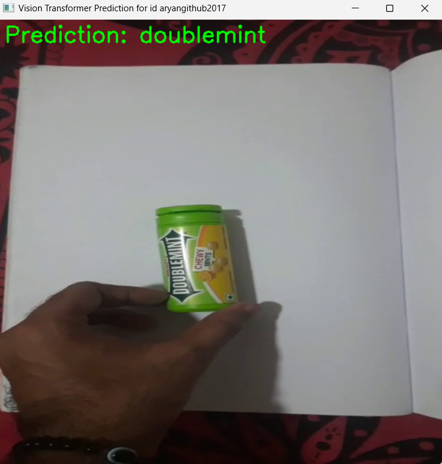
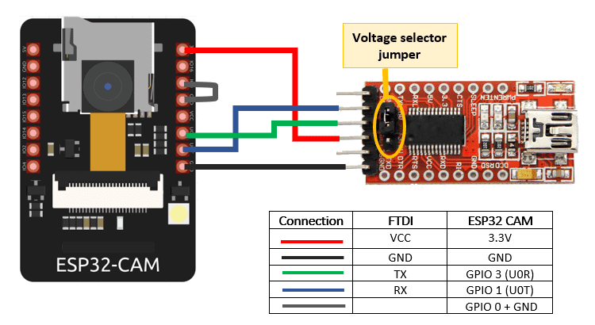

# AutoCheckout: AI-Powered Smart Billing System 🏍️🤖

AutoCheckout is an end-to-end smart billing system that eliminates the need for manual checkout in retail settings. It leverages a **Vision Transformer (ViT)** model for real-time object detection, live streaming via **ESP32-CAM**, real-time communication using **FastAPI**, data persistence with **Firebase Realtime Database**, and an **Android application** to display user-specific cart and history.

---
## 🌐 Live Web Interface

You can view the live backend/web interface hosted on Render here:

👉 **[Visit AutoCheckout Web App](https://autocheckouts.onrender.com/)**

_This REST API is responsible for receiving predictions from the client and pushing them to Firebase in real-time._

> ⚠️ **Note**: The Render server may go into sleep mode after a period of inactivity. If the site doesn't load immediately, please wait for about 1–2 minutes as it wakes up.

---

## 🌟 Features
- 🚀 Live object detection using a pretrained and fine-tuned Vision Transformer (ViT-B/16).
- 🎞️ ESP32-CAM-based live video stream to capture item images.
- 🔄 RESTful and WebSocket-based API to transmit data in real-time.
- 🔒 Firebase for secure, user-based storage of cart and purchase history.
- 📱 Android app that receives data and provides a seamless billing interface.

---

## 📂 Repository Structure
```bash
AutoCheckout/
├── VisionTransformer/        # Training scripts, model architecture, metrics
├── client/                   # Real-time prediction using camera stream
├── CameraWebServer/          # Arduino sketch for ESP32-CAM streaming
├── AutoCheckoutApp/          # Android app source code
├── media/                    # Screenshots, UI flow, hardware setup images
└── README.md                 # You're here!
```

---

## 🧠 VisionTransformer/
This directory contains training code for a **ViT-B/16** model customized for a 6-class retail item dataset.

### 🔧 Training Workflow
1. Dataset is preprocessed using torchvision transforms (resize, normalization).
2. Load `ViT_B_16_Weights.IMAGENET1K_V1` from torchvision.
3. Freeze transformer layers, attach a custom classification head.
4. Use **AdamW** optimizer and **label smoothing** with **Cosine Annealing** scheduler.
5. Metrics include **accuracy**, **precision**, **recall**, and **F1 score**.
6. The final model is saved as `model.pth`.

> 📸 You can visualize accuracy/loss plots and confusion matrices in this folder.

---

## 🔮 Real-time Predictions (client/)
This module uses OpenCV to stream and analyze video feed from ESP32-CAM.

### ⚖️ Steps to Run
```bash
cd client
python run2.py  # Make sure the stream is live and model.pth is present
```

- Frame is read from ESP32 stream
- Passed to ViT model for inference
- Detected label is sent to the backend via REST API

### 📸 Screenshots
> Live predictions on detected items:




---

## 🎥 ESP32-CAM Streaming (CameraWebServer/)
Streaming is performed locally using ESP32 and OV2640 camera.

### 🛠️ Upload via Arduino IDE
1. Install ESP32 board support in Arduino IDE.
2. Open `CameraWebServer.ino` from this folder.
3. Set Board to `AI Thinker ESP32-CAM`.
4. Replace SSID and PASSWORD fields with your WiFi credentials.
5. Connect ESP32 to USB, choose correct COM port.
6. Upload the code and open Serial Monitor.

> Stream will be available at:
```
http://<ESP_IP_ADDRESS>:81/stream
```

### 📷 Hardware Setup
> Add image of ESP32-CAM hardware:


---

## 🌐 Backend (REST API with FastAPI)
The server is a FastAPI application that exposes REST and WebSocket endpoints.

### ⚙️ Run Locally
```bash
cd backend
uvicorn main:app --host 0.0.0.0 --port 8000
```

- Receives prediction results
- Pushes updates to Firebase
- Emits WebSocket events to Android App

> Deployment is done on Render.com (or similar services)

---

## 🔥 Firebase Realtime Database
Used to store user-specific cart and billing history.

### 🔐 Firebase Authentication + Security
Only logged-in users can access their own data:
```json
{
  "rules": {
    "cart": {
      "$uid": {
        ".read": "$uid === auth.uid",
        ".write": "$uid === auth.uid"
      }
    },
    "history": {
      "$uid": {
        ".read": "$uid === auth.uid",
        ".write": "$uid === auth.uid"
      }
    },
    ".read": false,
    ".write": false
  }
}
```

---

## 📱 Android App (AutoCheckoutApp/)
The companion Android app listens for real-time updates from Firebase.

### 🔧 Features
- Firebase login with email/password
- Cart and history shown in RecyclerViews
- WebSocket listener for real-time billing updates
- Local storage of billing snapshots

### 🔐 Login Code
```java
FirebaseAuth mAuth = FirebaseAuth.getInstance();
mAuth.signInWithEmailAndPassword(email, password)
    .addOnCompleteListener(task -> {
        if (task.isSuccessful()) {
            FirebaseUser user = mAuth.getCurrentUser();
            startActivity(new Intent(Login.this, MainActivity.class));
        }
    });
```

### 📸 App UI Flow
> Add app flow screenshot here:
```md

```

---

## 🚀 Full Run Instructions
1. **ESP32-CAM**: Upload `CameraWebServer.ino` and connect to WiFi.
2. **FastAPI Backend**: Launch server with `uvicorn` or deploy on Render.
3. **Client**: Run prediction script with OpenCV to send results to API.
4. **Android App**: Install APK or build using Android Studio and login with Firebase credentials.

---

## 📩 Contributing
Feel free to submit pull requests to improve UI, add detection classes, or optimize performance.

---

## 🙏 Acknowledgements
- ESP32 and Arduino Community
- PyTorch & TorchVision
- Firebase by Google
- OpenCV contributors
- Render.com

---

> 🔒 **Make sure to secure your Firebase credentials (`.json` files)** and add them to `.gitignore` before pushing code.

